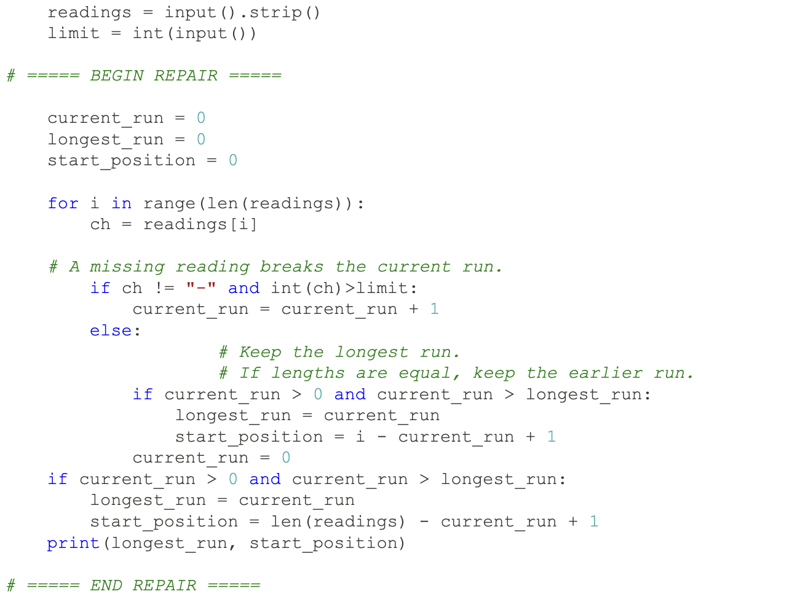
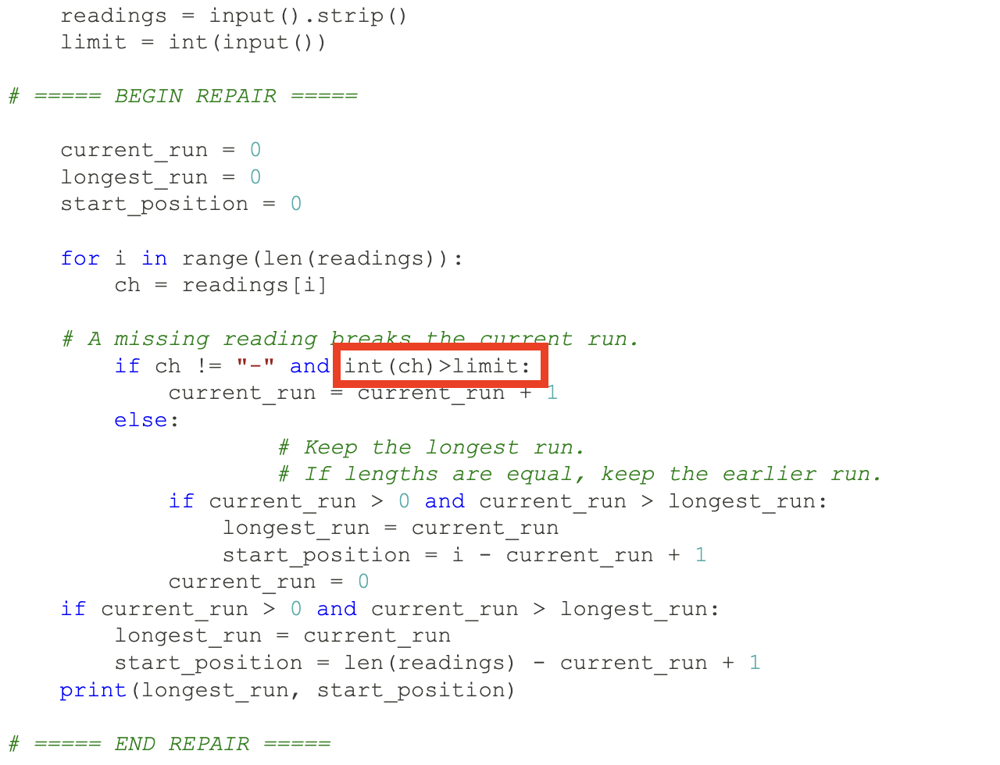
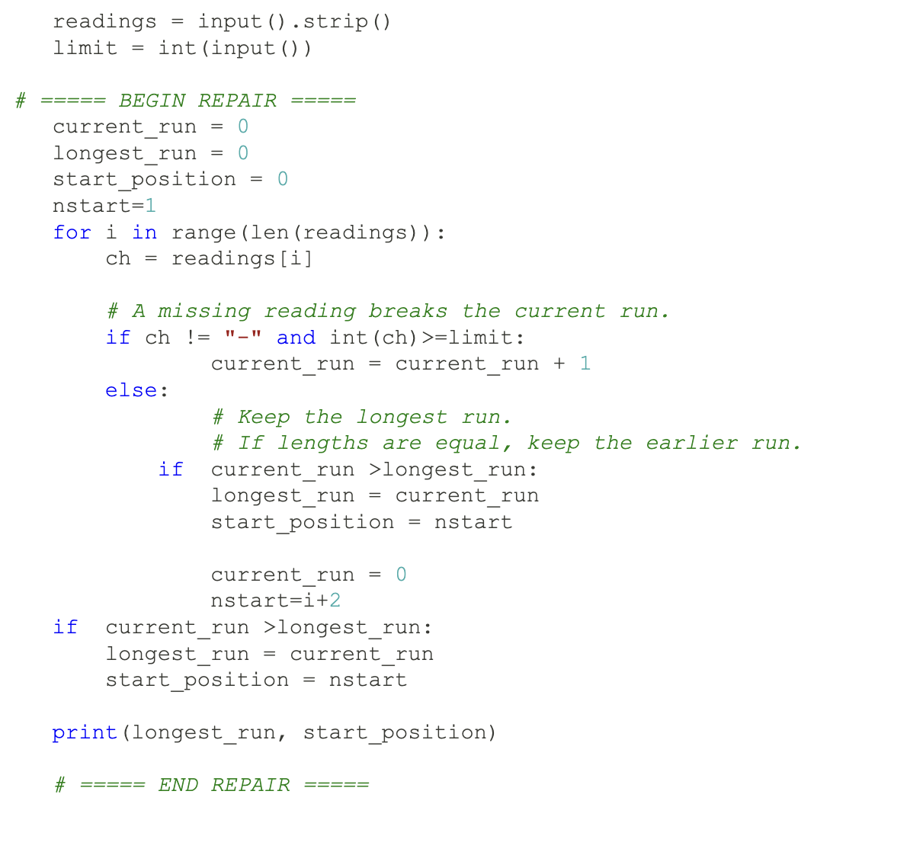
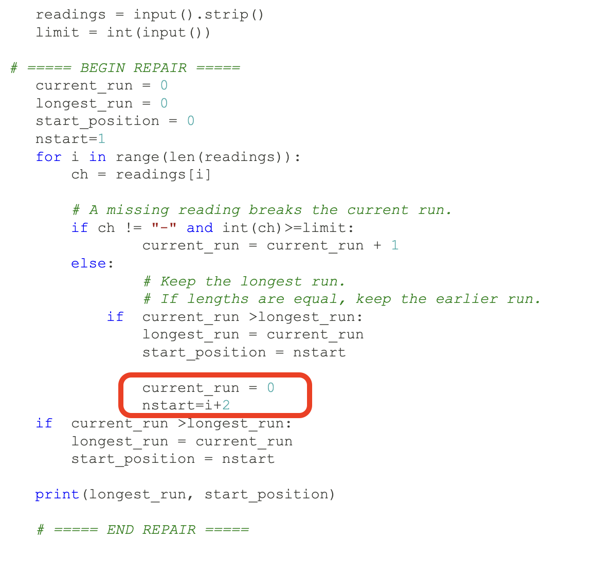
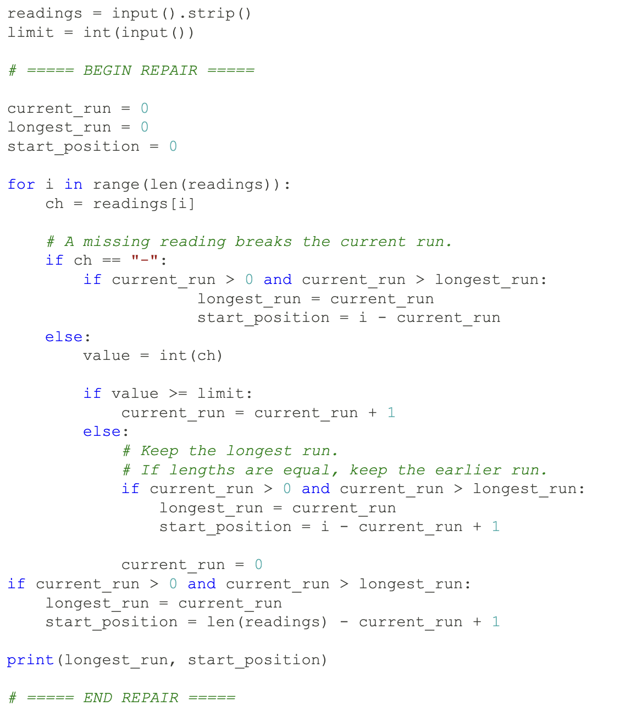
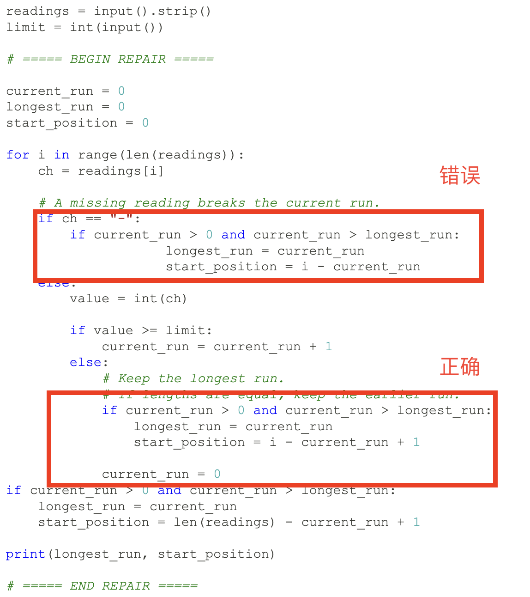

# 作业讲解

<!--s-->

# Problem 1

<!--v-->

## Problem 1

修复成绩统计程序：读入一个数字串，输出其**长度、数字和、平均值**。

知识点：调试、`str` 与 `int` 的区别、循环边界、变量命名、测试设计

<!--v-->

## 调试证据 1

使用原始程序和样例 `scores = 5839`：

- Python 第一次停在标记 **B**
- 此时 `total` 是 `0`，类型是 `int`
- `score` 是 `5`，类型是 `str`

原因：`total + score` 等价于 `int + str`，类型不匹配。

<!--v-->

## 调试证据 2

只把

```py
score = scores[i]
```

改成

```py
score = int(scores[i])
```

后，前 4 个数字可以正常求和，但 `range(count + 1)` 会让 `i` 取到 `4`。

- 程序停在标记 **A**
- `i = 4`
- `count = 4`
- `total = 25`

这是字符串下标越界。

<!--v-->

## 调试证据 3

继续把

```py
range(count + 1)
```

改成

```py
range(count)
```

后，循环已经正确，但程序使用了未定义的名字 `totals`。

- 程序停在标记 **C**
- 错误使用的名字是 `totals`
- 应该使用的名字是 `total`
- 此时 `total = 25`

<!--v-->

## 标准答案

```py[]
scores = input().strip()

count = len(scores)
total = 0

for i in range(count):
    score = int(scores[i])
    total = total + score

average = total / count
print(count, total, average)
```

对于 `5839`，输出：

```text
4 25 6.25
```

<!--v-->

<!--s-->

# Problem 2

<!--v-->

## Problem 2

打印一个右对齐的直角三角形：

- 第 1 行有 1 个字符
- 第 2 行有 2 个字符
- ...
- 第 `n` 行有 `n` 个字符

知识点：`for` 循环、`range`、字符串重复、字符串拼接

<!--v-->

## 标准答案

```py[]
n = int(input())
c = input()

for i in range(1, n + 1):
    print(' ' * (n - i) + c * i)
```

<!--v-->

## 代码逐行理解

当 `i` 从 1 增加到 `n` 时：

- 字符数量是 `i`，所以写成 `c * i`
- 空格数量是 `n - i`
- 空格逐渐减少，字符逐渐增加，整体右对齐

例如 `n = 4`、`c = *` 时：

```text
   *
  **
 ***
****
```

<!--v-->

### （拓展）另一种理解

- `range(1, n + 1)` 表示 `1, 2, ..., n`
- `字符串 * 整数` 表示重复字符串
- `+` 可以拼接两个字符串

这题不需要双重循环。直接构造每一行的空格部分和字符部分，代码更短，也更容易检查。

<!--s-->

# Problem 3

<!--v-->

## Problem 3

计算 Collatz 序列从 `n` 变到 `1` 需要的步数。

规则：

- 如果 `n` 是偶数，`n = n // 2`
- 如果 `n` 是奇数，`n = 3n + 1`
- 重复直到 `n == 1`

知识点：`while` 循环、条件语句、整除运算、整数与浮点数

<!--v-->

## 标准答案

```py[]
n = int(input())

count = 0
while n != 1:
    if n % 2 == 0:
        n //= 2
    else:
        n = 3 * n + 1
    count += 1

print(count)
```

<!--v-->

## 为什么用 `//`

```py
n //= 2
```

而不是

```py
n /= 2
```

- `/` 的结果永远是 `float`
- `//` 在两个整数相除时保留整数类型
- 本题始终在整数序列上操作，使用整除更符合题意

<!--s-->

# Problem 4

<!--v-->

## Problem 4

找出最长的连续高读数区间：

- 高读数：数字大于等于 `limit`
- 低读数：数字小于 `limit`
- 缺失读数：`-`
- 低读数和缺失读数都会断开连续区间

输出最长长度和最早开始位置。

知识点：区间维护、边界处理、严格大于、下标换算

<!--v-->

## 反例 A：处理 `-`

```text
readings = 114-514
limit = 3
```

正确答案是：

```text
1 3
```

minute 3 的 `4` 是唯一达到阈值的读数；后面的 `-` 必须断开当前区间。

<!--v-->

## 反例 B：长度相同取最早

```text
readings = 233233233
limit = 3
```

正确答案是：

```text
2 2
```

这里有多段长度相同的区间。题目要求取**最早开始**的一段，所以更新条件应使用：

```py
current_run > longest_run
```

而不是 `>=`。

<!--v-->

## 标准答案

```py[]
readings = input().strip()
limit = int(input())

current_run = 0
longest_run = 0
start_minute = 0

for i in range(len(readings)):
    ch = readings[i]

    if ch == '-' or int(ch) < limit:
        current_run = 0
    else:
        current_run += 1

        if current_run > longest_run:
            longest_run = current_run
            start_minute = i - current_run + 2

print(longest_run, start_minute)
```

<!--v-->

## 核心思想

- `current_run` 记录**当前连续区间长度**
- 遇到低读数或缺失读数时，立即清零
- 遇到高读数时，长度加一
- 只有**严格大于**历史最长时才更新答案
- `i` 是从 0 开始的下标，题目分钟数从 1 开始

```py
start_minute = i - current_run + 2
```

<!--v-->

## 常见错误

1. 忘记 `-` 也会断开区间
2. 只在遇到低读数时更新答案，忘记序列末尾也是区间边界
3. 使用 `>=` 更新，导致同样长度时取到较晚区间
4. 把 0-based 下标直接当题目中的分钟数输出
5. 没有先明确当前区间和历史最优区间分别记录什么

<!--v-->

## 错误代码 (17pt)



**这份代码错在哪里？**

<!--v-->

## 错误代码 (17pt)



**少了一个等号就损失了三分！**

<!--v-->

## 错误代码 (19pt)



**这份代码错在哪里？**

<!--v-->

## 错误代码 (19pt)



**注意缩进！**

<!--v-->

## 错误代码 (16pt)



**这份代码错在哪里？**

<!--v-->

## 错误代码 (16pt)



**情况相同，但是各自的代码却写的不一样。**

<!--s-->

# Problem 5

<!--v-->

## Problem 5

给定数字串 `s` 和步长 `k`：

1. 从左到右，每隔 `k` 个取一个数字求和
2. 从右到左，每隔 `k` 个取一个数字求乘积

知识点：`range` 的三个参数、字符串下标、累加、累乘

<!--v-->

## 标准答案

```py[]
s = input()
k = int(input())

total = 0
for i in range(0, len(s), k):
    total += int(s[i])
print(total)

product = 1
for i in range(len(s) - 1, -1, -k):
    product *= int(s[i])
print(product)
```

这里用 `total` 代替内置函数名 `sum`，避免覆盖内置名字。

<!--v-->

## `range` 三参数

```py
range(start, stop, step)
```

从左到右：

```py
range(0, len(s), k)
```

产生的下标是：

```text
0, k, 2k, ...
```

从右到左：

```py
range(len(s) - 1, -1, -k)
```

产生的下标是：

```text
len(s)-1, len(s)-1-k, ...
```

<!--v-->

## 例子

若：

```text
s = 123456
k = 2
```

求和取下标 `0, 2, 4`：

```text
1 + 3 + 5 = 9
```

求乘积取下标 `5, 3, 1`：

```text
6 × 4 × 2 = 48
```

因此输出：

```text
9
48
```

<!--v-->

## 累加与累乘

累加初值：

```py
total = 0
```

累乘初值：

```py
product = 1
```

因为任何数加 `0` 不变，任何数乘 `1` 不变。

不要把乘积初值写成 `0`，否则最终结果一定是 `0`。

<!--s-->

# 总结

<!--v-->

## 本次作业关键词

- **类型**：字符串数字和整数不同
- **边界**：`range(count)`、字符串末尾、序列末尾
- **循环**：`for` 适合确定范围，`while` 适合未知次数
- **区间**：当前长度、历史最长、更新条件
- **命名**：变量名必须完全一致，尽量不要覆盖内置名

<!--v-->

## 调试建议

1. 先读题和样例，再写代码
2. 明确每个变量的含义和类型
3. 手动模拟一个短样例
4. 遇到错误时，看第一处错误，不要只看最终报错行
5. 修复一个错误后重新运行，再找下一个错误

<!--s-->
